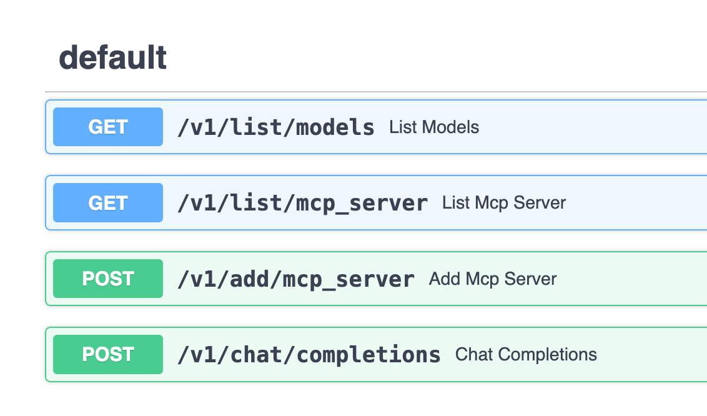

# Amazon Nova MCP [[English Readme](./README.en.md)]

> ChatBot 是大模型时代最常见的应用形态，但受限于大模型无法获取及时信息、无法操作外部系统等，使得 ChatBot 应用场景相对有限。后来随着 Function Calling/Tool Use 功能推出，大模型能够跟外部系统交互，但弊端在于大模型业务逻辑和 Tool 开发都是紧密耦合的，无法发挥出 Tool 端规模化的效率。Anthropic 2024 年 11 月底推出 [MCP](https://www.anthropic.com/news/model-context-protocol) 打破了这一局面，引入整个社区的力量在 Tool 端规模化发力，目前已经有开源社区、各路厂商等开发了丰富的 [MCP server](https://github.com/modelcontextprotocol/servers)，使得 Tool 端蓬勃发展。终端用户即插即用就可将其集成到自己的 ChatBot 中，极大延展了 ChatBot UI 的能力，有种 ChatBot 一统各种系统 UI 的趋势。

本项目提供基于 **Bedrock** 中Nova,Claude等大模型的 ChatBot 交互服务，同时引入 **MCP**，极大增强并延伸 ChatBot 形态产品的应用场景，可支持本地文件系统、数据库、开发工具、互联网检索等无缝接入。如果说包含大模型的 ChatBot 相当于大脑的话，那引入 MCP 后就相当于装上了胳膊腿，真正让大模型动起来、跟各种现存系统和数据联通。


该项目目前仍在不断探索完善，MCP 正在整个社区蓬勃发展，欢迎大家一起关注！

## 项目特点：
- 同时支持Amazon Nova Pro和Claude Sonnet3.5模型
- 与Anthropic官方MCP标准完全兼容，可以采用同样的方式，直接使用社区的各种[MCP servers](https://github.com/modelcontextprotocol/servers/tree/main)
- 将MCP能力和客户端的解耦，MCP能力封装在服务端，对外提供API服务，且chat接口兼容openai，方便接入其他chat客户端


## 1. 依赖安装

目前主流 MCP Server 基于 NodeJS 或者 Python 开发实现并运行于用户 PC 上，因此用户 PC 需要安装这些依赖。

### NodeJS

NodeJS [下载安装](https://nodejs.org/en)，本项目已对 `v22.12.0` 版本充分测试。

### Python

有些 MCP Server 基于 Python 开发，因此用户必须安装 [Python](https://www.python.org/downloads/)。此外本项目代码也基于 Python 开发，需要安装环境和依赖。

首先，安装 Python 包管理工具 uv，具体可参考 [uv](https://docs.astral.sh/uv/getting-started/installation/) 官方指南，本项目已对 `v0.5.11` 版本充分测试。

## 2. 环境和配置

### 环境准备

下载克隆该项目后，进入项目目录创建 Python 虚拟环境并安装依赖：
```bas
uv sync
```

此时项目目录的 `.venv` 中就创建好了虚拟环境,激活
```
source .venv/bin/activate
```

### 配置编辑

项目配置写入 `.env` 文件，应包含以下配置项（建议拷贝 `env_dev` 在其基础上修改）：

```
AWS_ACCESS_KEY_ID=<your-access-key>
AWS_SECRET_ACCESS_KEY=<your-secret-key>
AWS_REGION=us-east-1
LOG_DIR=./logs
CHATBOT_SERVICE_PORT=<chatbot-ui-service-port>
MCP_SERVICE_HOST=127.0.0.1
MCP_SERVICE_PORT=<bedrock-mcp-service-port>
API_KEY=<your-new-api-key>
```

备注：该项目用到 **AWS Bedrock Nova** 系列大模型，因此需要注册并获取以上服务访问密钥。

## 3. 运行

该项目包含两个服务：

- **Chat 接口服务（Bedrock+MCP）**，可对外提供 Chat 接口、同时托管多个 MCP server、支持历史多轮对话输入、响应内容附加了工具调用中间结果、暂不支持流式响应
- **ChatBot UI 服务**，跟上述 Chat 接口服务通信，提供多轮对话、管理 MCP 的 Web UI 演示服务

### Chat 接口服务（Bedrock+MCP）
- 接口服务可以对外提供给独立API，接入其他chat客户端, 实现服务端MCP能力和客户端的解耦
- 可以通过http://{ip}:7002/docs#/查看接口文档.


编辑配置文件 `conf/config.json`，该文件预设了要启动哪些 MCP server，可以编辑来添加或者修改 MCP server 参数。

每个 MCP server 的参数规范，可参考如下示例：

```
"db_sqlite": {
    "command": "uvx",
    "args": ["mcp-server-sqlite", "--db-path", "./tmp/test.db"],
    "env": {},
    "description": "DB Sqlite CRUD - MCP Server",
    "status": 1
}
```

启动服务：

```bash
bash start_all.sh
```

待启动后，可查看日志 `logs/start_mcp.log` 确认无报错，然后可运行测试脚本检查 Chat 接口：

```bash
# 脚本使用 Bedrock 的 Amazon Nova-lite 模型，也可更换其它
# 默认使用123456作为API key, 请根据实际设置更改
curl http://127.0.0.1:7002/v1/chat/completions \
  -H "Content-Type: application/json" \
  -H "Authorization: Bearer 123456" \
  -d '{
    "model": "amazon.nova-lite-v1:0",
    "messages": [
      {
        "role": "user",
        "content": "show all of tables in db"
      }
    ]
  }'
```

- Demo 示例1: 使用Amazon Knowledge Base
先在Bedrock console中创建或者使用已有的Bedrock，记下Knowledge Base Id  
Clone [AWS Knowledge Base Retrieval MCP Server](https://github.com/modelcontextprotocol/servers)到本地，并用[docs/aws-kb-retrieval-server/index.ts)](docs/aws-kb-retrieval-server/index.ts)下的文件替换 `src/aws-kb-retrieval-server/index.ts`里的文件。  
> 新文件把knowledgeBaseId通过环境变量指定，无须再通过对话传入。  

在新clone的servers目录下用如下命令打包  
```sh
docker build -t mcp/aws-kb-retrieval:latest -f src/aws-kb-retrieval-server/Dockerfile . 
```

然后在chatbot界面上添加这个json文件，注意env中的字段需要替换成自己的账号信息，以及Knowledge Base Id   
```json
{
  "mcpServers": {
    "aws-kb-retrieval": {
      "command": "docker",
      "args": [ "run", "-i", "--rm", "-e", "AWS_ACCESS_KEY_ID", "-e", "AWS_SECRET_ACCESS_KEY", "-e", "AWS_REGION", "-e", "knowledgeBaseId", "mcp/aws-kb-retrieval:latest" ],
      "env": {
        "AWS_ACCESS_KEY_ID": "YOUR_ACCESS_KEY_HERE",
        "AWS_SECRET_ACCESS_KEY": "YOUR_SECRET_ACCESS_KEY_HERE",
        "AWS_REGION": "YOUR_AWS_REGION_HERE",
        "knowledgeBaseId":"The knowledage base id"
      }
    }
  }
}
```


### ChatBot UI 服务

待启动后，可查看日志 `logs/start_chatbot.log` 确认无报错，然后浏览器打开[服务地址](http://localhost:8502/)，即可体验 MCP 增强后的 Bedrock 大模型 ChatBot 能力。

由于已内置了文件系统操作、SQLite 数据库等 MCP Server，可以尝试连续提问以下问题进行体验：

```
show all of tables in the db
how many rows in that table
show all of rows in that table
save those rows record into a file, filename is rows.txt
list all of files in the allowed directory
read the content of rows.txt file
```

## 4. 添加 MCP Server

当前可以通过两种方式来添加 MCP Server：

1. 预置在 `conf/config.json`，每次重新启动 Chat 接口服务就会加载配置好的 MCP Server
2. 通过 ChatBot UI 来添加 MCP Server，表单提交 MCP Server 参数即可，仅当前生效、服务重启后失效

下面演示如何通过 ChatBot UI 添加 MCP Server，这里以 Web Search 供应商 [Exa](https://exa.ai/) 为例，开源社区已有针对它的 [MCP Server](https://github.com/exa-labs/exa-mcp-server) 可用。

首先，前往 [Exa](https://exa.ai/) 官网注册账号，并获取 API Key。

然后点击【添加 MCP Server】，在弹出菜单中填写如下参数并提交即可：
- 方式1，直接添加MCP json 配置文件(与Anthropic官方格式相同)
  
```json
{
  "mcpServers": {
    "exa": {
      "command": "npx",
      "args": ["-y","exa-mcp-server"],
      "env": {
        "EXA_API_KEY": "your-api-key-here"
      }
    }
  }
}
```
- 方式2，按字段添加 
  

此时在已有 MCP Server 列表中就可以看到新添加项，勾选即可启动该 MCP Server。

## 开启Deep Research
- 同时启用 websearch(参考上面的EXA配置)和 [Sequential Thinking MCP Server](https://github.com/modelcontextprotocol/servers/tree/main/src/sequentialthinking)，目前已经预置了Sequential Thinking MCP Server在配置文件中, 启动后可以看到server名称是cot。  

- Sequential Thinking提供通过动态的结构化思维过程和反思，通过工具调用的促使模型按工具输入的要求进行结构化输出推理链条。
- EXA Search 同时提供关键词和向量检索搜索网络知识，并返回页面的上的详细内容。
- 测试问题
```
1. use search tool and sequential thinking to make comparison report between different agents frameworks such as autogen, langgraph, aws multi agents orchestrator
2. use sequential thinking and search tool to make me a travel plan to visit shanghai between 3/1/2025 to 3/5/2025. I will departure from Beijing
3. use sequential thinking to research what the key breakthroughs and future impact of deepseek r1
4. 搜索对比火山引擎，阿里百炼，硅基流动上的对外提供的deepseek r1 满血版的API 性能对比, 包括推理速度，TTFT， 最大context长度等。使用sequential thinking 工具
```
- 效果一览


## 5. 停止服务
```bash
bash stop_all.sh
```


[LICENSE](./LICENSE)