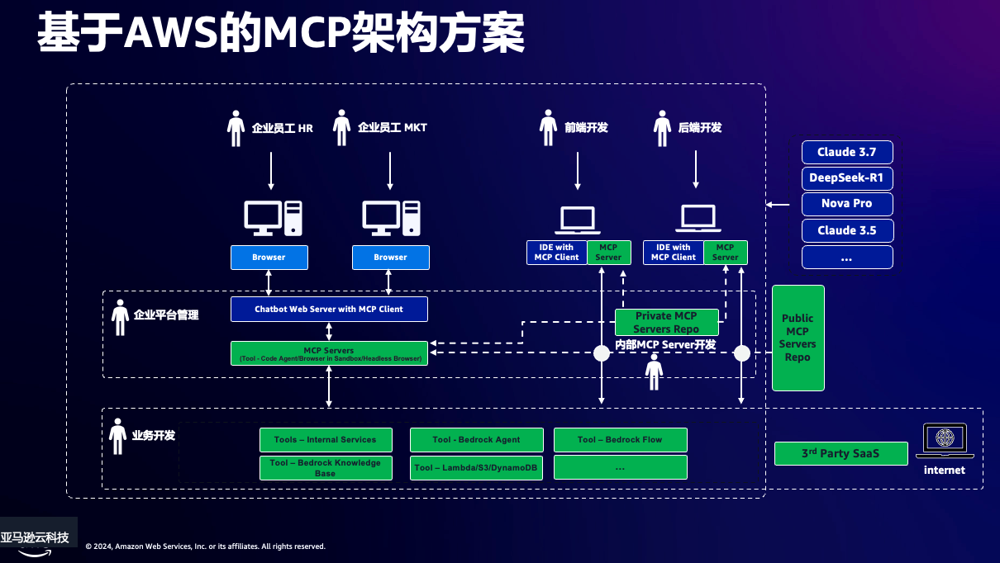

# CDK Deployment Guide for MCP on Amazon Bedrock

This guide explains how to deploy the MCP on Amazon Bedrock infrastructure using AWS CDK.

## Architecture Overview



The infrastructure consists of the following AWS components:

1. **VPC Configuration**
   - 2 Availability Zones
   - Public and Private subnets
   - NAT Gateway for private subnet internet access

2. **Application Load Balancer (ALB)**
   - Internet-facing
   - Listener on port 8502 for Streamlit UI
   - Health checks configured

3. **Auto Scaling Group (ASG)**
   - Uses t3.medium instances
   - Ubuntu 22.04 LTS AMI
   - Deployed in private subnets
   - Min/Max capacity: 1/1

4. **Security Group**
   - Allows inbound traffic on port 8502 (Streamlit UI)
   - Allows all outbound traffic

5. **IAM Configuration**
   - EC2 Instance Role with SSM access
   - Bedrock API access permissions
   - API User for programmatic access

## Prerequisites

1. AWS CLI installed and configured
2. Node.js v22.x or later
3. AWS CDK CLI installed (`npm install -g aws-cdk`)
4. TypeScript (`npm install -g typescript`)

## Required IAM Permissions

To deploy this stack, you need an IAM user/role with the following permissions:

```json
{
    "Version": "2012-10-17",
    "Statement": [
        {
            "Effect": "Allow",
            "Action": [
                "ec2:*",
                "elasticloadbalancing:*",
                "autoscaling:*",
                "iam:*",
                "cloudformation:*",
                "bedrock:*",
                "ssm:*"
            ],
            "Resource": "*"
        }
    ]
}
```

## Deployment Steps

1. **Install dependencies**
   ```bash
   cd cdk
   npm install   # This will install all required dependencies including aws-cdk-lib and constructs
   npm run build # This will compile the TypeScript code
   ```

   Note: If you see TypeScript errors about missing modules, make sure the dependencies are properly installed by running `npm install` again.

2. **Deploy the stack**

   You can deploy the stack using a timestamp-based qualifier to avoid naming conflicts when deploying multiple instances:

   ```bash
   # Deploy with timestamp-based qualifier
   TIMESTAMP=$(date +%H%M%S) && \
   cdk synth --context qualifier=cdk$TIMESTAMP && \
   cdk bootstrap --context qualifier=cdk$TIMESTAMP --qualifier cdk$TIMESTAMP --toolkit-stack-name CDKToolkit-cdk$TIMESTAMP && \
   cdk deploy --context qualifier=cdk$TIMESTAMP --toolkit-stack-name CDKToolkit-cdk$TIMESTAMP
   ```

   Or use a custom qualifier:

   ```bash
   cdk bootstrap --qualifier <your-qualifier>
   cdk deploy --qualifier <your-qualifier>
   ```

   Note: The qualifier is required and must be provided via --context qualifier=<value> or --qualifier=<value>

## Stack Outputs

After deployment, the CDK stack outputs:

1. **Streamlit-Endpoint**: URL to access the Streamlit UI
2. **ApiAccessKeyId**: Access Key ID for API access
3. **ApiSecretAccessKey**: Secret Access Key for API access

## Configuration

The stack creates:

1. **IAM User**: For API access with Bedrock permissions
   - Username format: `bedrock-mcp-api-user-<stack-name>`
   - Permissions: `bedrock:InvokeModel*`, `bedrock:ListFoundationModels`

2. **EC2 Instance Role**: For EC2 instances with:
   - SSM access for management
   - Bedrock API access

## Security Considerations

1. Access keys are generated and exposed in CloudFormation outputs
2. The ALB is internet-facing - consider IP restrictions if needed
3. EC2 instances are in private subnets with NAT Gateway access
4. Security group limits inbound access to Streamlit port only

## Customization

You can customize the deployment by modifying:

1. **Instance Type**: Change the EC2 instance type in `bedrock-mcp-stack.ts`
2. **Auto Scaling**: Adjust min/max capacity
3. **VPC Configuration**: Modify CIDR ranges or AZ count
4. **Region**: Set via `CDK_DEFAULT_REGION` environment variable

## CDK Configuration

The CDK app uses the following configuration:

1. **TypeScript Configuration (tsconfig.json)**
   - Target: ES2020
   - Module: CommonJS
   - Strict type checking enabled
   - Output directory: dist/

2. **CDK Context**
   - Qualifier: Required for resource naming and asset management
   - Region: Defaults to us-east-1 if not specified
   - Account: Uses the default AWS account from AWS CLI configuration

## Troubleshooting

1. **TypeScript Compilation Errors**
   - Ensure all dependencies are installed: `npm install`
   - Check node_modules directory exists
   - Verify tsconfig.json is present and correctly configured
   - Run `npm run build` to check for compilation errors

2. **CDK Deployment Issues**
   - Verify AWS credentials are properly configured
   - Ensure CDK is bootstrapped in your account/region
   - Check CloudFormation console for detailed error messages
   - Verify you have sufficient IAM permissions

3. **Runtime Issues**
   - Check EC2 instance logs via AWS Systems Manager
   - Verify security group allows required traffic
   - Check ALB health check status
   - Monitor CloudWatch logs for application issues

## Cleanup

To remove all resources, use the same qualifier that was used during deployment:

If you used a timestamp-based qualifier:
```bash
# Replace TIMESTAMP with the timestamp used during deployment
cdk destroy --context qualifier=cdk$TIMESTAMP --toolkit-stack-name CDKToolkit-cdk$TIMESTAMP
```

Or if you used a custom qualifier:
```bash
cdk destroy --qualifier <your-qualifier>
```

Note: This will delete all resources including the EC2 instances, ALB, and IAM roles/users. Make sure to backup any data before destroying the stack.
